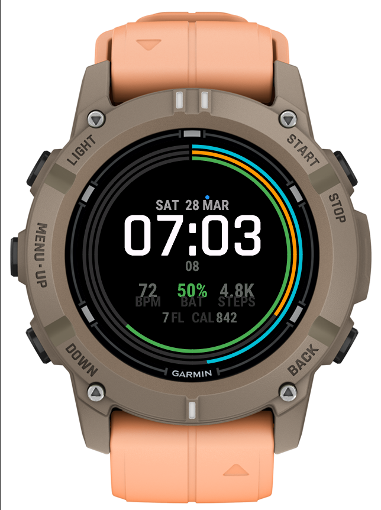

# Windfall — Watch Face for Garmin

A clean, modern watch face with activity rings and essential fitness data at a glance.



---

## What You See

### Time & Date
The time is displayed large and centered for instant readability. The current seconds appear just below in a subtle gray — they disappear in always-on mode to save battery. The date is shown at the top in uppercase (e.g. SAT 28 MAR).

### Activity Rings
Three concentric progress rings surround the display, each tracking a different daily goal:

| Ring | Color | What it tracks | Goal |
|------|-------|----------------|------|
| Outer | Teal | **Steps** | Your daily step goal (from Garmin settings) |
| Middle | Orange | **Calories** | 2,000 kcal daily target |
| Inner | Green | **Active Minutes** | 150 min/week (WHO recommendation) |

The rings fill clockwise throughout the day. A dark track shows the remaining distance to your goal.

### Fitness Data
Below the time, three key metrics are displayed:

- **BPM** — Current heart rate (red/coral)
- **BAT** — Battery percentage (green when >20%, red when low)
- **STEPS** — Step count in compact format (e.g. 4.8K)

### Additional Info
At the bottom row:
- **FL** — Floors climbed today (blue)
- **CAL** — Calories burned today (orange)

### Bluetooth Indicator
A small blue dot near the top appears when your phone is connected.

---

## Supported Devices

Currently optimized for round AMOLED displays at 390x390 resolution:

- Garmin Descent G2
- Garmin Descent Mk3 43mm / Mk3i 43mm

More devices planned (Forerunner 165, Vivoactive 5/6, Venu 3S/4S, Instinct 3 AMOLED).

---

## Installation

### From Connect IQ Store
*Coming soon* — The watch face will be available for free in the Garmin Connect IQ Store.

### Sideloading (Manual Install)
1. Download the latest `.prg` file from [Releases](https://github.com/martjn-net/garmin-watchface-windfall/releases)
2. Connect your watch via USB
3. Copy the `.prg` file to the `GARMIN/Apps/` folder on your watch
4. Safely eject the watch
5. On your watch, go to watch face settings and select "Windfall"

---

## Building from Source

### Prerequisites

| Component | Version |
|-----------|---------|
| Java JDK | 17 or 21 |
| VS Code | Current |
| Monkey C Extension | `garmin.monkey-c` |
| Connect IQ SDK | 9.x+ |

### Setup (Ubuntu/Linux)

```bash
# Install Java
sudo apt install openjdk-21-jdk

# Install SDK Manager CLI
go install github.com/lindell/connect-iq-sdk-manager-cli@latest

# Accept license and install SDK
connect-iq-sdk-manager-cli agreement accept
connect-iq-sdk-manager-cli sdk set 9.1.0

# Download device files WITH fonts (important!)
connect-iq-sdk-manager-cli device download -d descentg2 --include-fonts
```

### Build

```bash
# Set environment
export JAVA_HOME=/usr/lib/jvm/java-21-openjdk-amd64
export PATH="$HOME/.Garmin/ConnectIQ/Sdks/connectiq-sdk-lin-*/bin:$PATH"

# Compile
monkeyc -d descentg2 -f monkey.jungle -o bin/WindfallApp.prg \
    -y ~/.Garmin/ConnectIQ/developer_key.der -w
```

### Run in Simulator

The native simulator requires `libwebkit2gtk-4.0` which is unavailable on Ubuntu 24.04. Use the AppImage from [pcolby/connectiq-sdk-manager](https://github.com/pcolby/connectiq-sdk-manager):

```bash
# Install AppImages (includes Simulator)
curl -Ls https://raw.githubusercontent.com/pcolby/connectiq-sdk-manager/main/install.sh | bash

# Start simulator
~/.Garmin/ConnectIQ/AppImages/Connect_IQ_Simulator-*.AppImage &

# Load watch face
monkeydo bin/WindfallApp.prg descentg2
```

### Build in VS Code
1. Open the project folder in VS Code
2. Press **F5** to build and launch in the simulator
3. Select "Run on Descent G2" from the launch configuration

---

## Project Structure

```
source/
  WindfallApp.mc       # Application entry point
  WindfallView.mc      # Watch face rendering and data display
resources/
  drawables/           # Icons and images
  strings/             # Localized strings (EN, DE)
  layouts/             # UI layout definitions
manifest.xml           # Device targets, permissions, API level
monkey.jungle          # Build configuration
```

---

## License

MIT

---

## Credits

Built with [Garmin Connect IQ SDK](https://developer.garmin.com/connect-iq/) and Monkey C.
